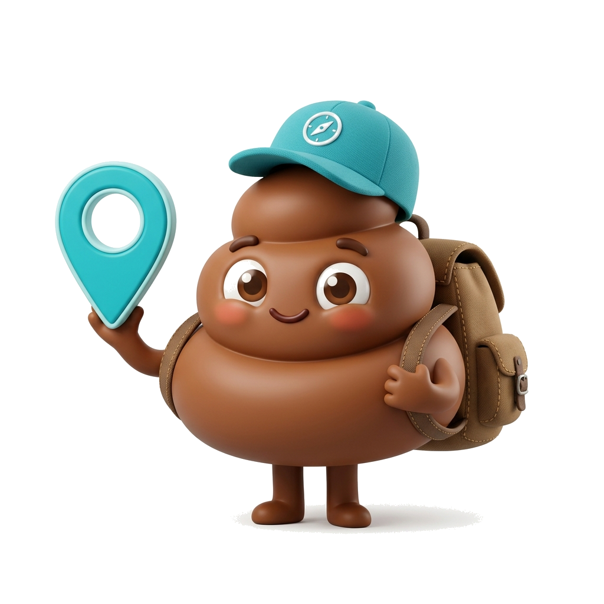

# 🧻 CROTTOQ — L'explorateur mondial des toilettes

[](https://fcastand.github.io/crottoq/)

> La première application communautaire qui cartographie les toilettes publiques et privées accessibles. Trouvez, notez et ajoutez des WC rapidement dans une ambiance cartoon et ludique !



## ✨ Fonctionnalités

- 🗺️ **Carte interactive** — Visualisez toutes les toilettes autour de vous (propulsé par Leaflet & OpenStreetMap)
- 🔍 **Détails complets** — Propreté, confort, accessibilité PMR, papier, prix, accès
- ⭐ **Système d'avis** — Notez et commentez chaque toilette
- 🚨 **Bouton SOS** — Trouvez instantanément la toilette la plus proche
- 🛡️ **Modération intégrée** — Signalez les mauvaises toilettes, les modérateurs peuvent supprimer
- 👤 **Profil & XP** — Gagnez de l'expérience en ajoutant et notant des toilettes
- 🎵 **Effets sonores** — Une ambiance sonore immersive et humoristique
- 📱 **Design mobile-first** — Interface responsive avec simulateur smartphone sur desktop

## 🚀 Lancer l'application

### Prérequis
Aucune dépendance externe requise ! L'app tourne avec un simple serveur PowerShell.

### Démarrage

```powershell
# Lancer le serveur local
powershell -ExecutionPolicy Bypass -File server.ps1
```

Puis ouvrir dans le navigateur : **http://127.0.0.1:8085/**

### Comptes de démonstration

| Rôle | Nom d'utilisateur | Rôle à sélectionner |
|------|-------------------|---------------------|
| Utilisateur normal | N'importe quel nom | `Visiteur` |
| Modérateur | N'importe quel nom | `Modérateur` |

## 🗂️ Structure du projet

```
crottoq/
├── index.html          # Interface principale (toutes les vues)
├── styles.css          # Design system complet
├── app.js              # Handlers & logique applicative
├── state.js            # État global & données (localStorage)
├── map.js              # Système de carte Leaflet
├── drawer.js           # Panneaux & fiches détail
├── router.js           # Routeur de vues
├── audio.js            # Système audio
├── mascot_bobby.png    # Mascotte officielle Bobby 🐾
└── server.ps1          # Serveur HTTP PowerShell (sans Node.js)
```

## 🛠️ Stack technique

| Technologie | Usage |
|-------------|-------|
| **HTML5 / CSS3 / JS ES6** | Core de l'application |
| **Leaflet.js** | Carte interactive |
| **OpenStreetMap / CartoDB** | Tuiles cartographiques |
| **Font Awesome 6** | Icônes |
| **Google Fonts (Outfit)** | Typographie |
| **LocalStorage** | Persistance des données en local |
| **PowerShell HttpListener** | Serveur de développement |

## 🎮 Fonctionnement de l'app

1. **Splash screen** → s'efface automatiquement après 2.8s
2. **Login** → entrez un pseudo et choisissez votre rôle
3. **Carte** → explorez les toilettes, cliquez sur les marqueurs
4. **Profil** → suivez votre XP, vos badges et statistiques
5. **Modération** (rôle modérateur uniquement) → gérez les signalements

## 📋 Données de démo

L'application inclut 5 toilettes de démonstration centrées sur Paris (Louvre / Châtelet) avec différents niveaux de propreté et de signalement pour tester toutes les fonctionnalités.

## 🔮 Évolutions prévues

- [ ] Backend MySQL pour données persistantes multi-utilisateurs
- [ ] Géolocalisation GPS réelle
- [ ] Filtres de recherche avancés (prix, PMR, distance)
- [ ] Classement mondial des explorateurs
- [ ] PWA / App mobile native

## 📄 Licence

MIT License — Fait avec 💩 passion par Bobby & l'équipe CROTTOQ © 2026
